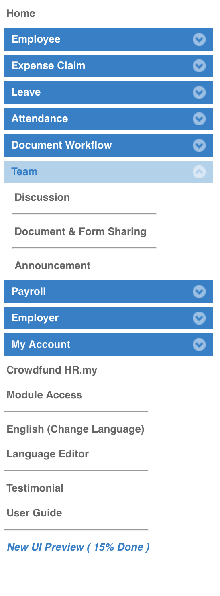
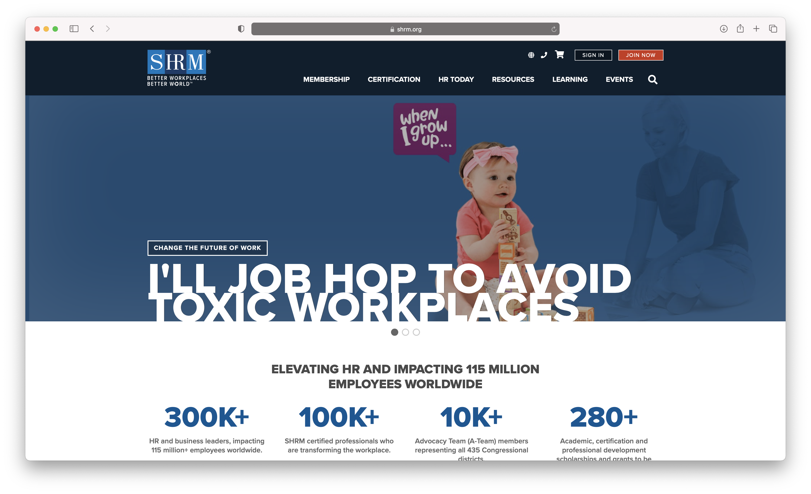

# Assignment 01 — DH110 Spring 2021

## by Justin Grant UX Researcher UCLA
### Human Resources Heuristics

I am the web developer and designer for a company that produces HR material for employers and HR Professionals.  This project's goal is to help me understand how HR websites differ from hrsimple.com. My intent is to learn what is missing from hrsimple.com by performing heuristics on competitor websites. 

### HR.my Heuristics

You can Visit HR.my by clicking this link: <a href="https://hr.my" target="_blank" aria-label="External link to HR.my website">Visit HR.my website</a>

HR.my is a website for employers to track employee information.  HR.my allows employers to set specific tasks for employees like clocking into work, or requesting vacation time.  Most of all, the website is tailored for both employer and employee.  The employer sets up the account and tracks their employee and the employee gets access to the site to view their information and request specific actions. 

Overall, the website is minimal in design but needs significant improvement.  The website is free to use, but the web developer does ask for donations, too. I signed up for free and was notified with an informative error message that I already had an account.  Requesting to change my password was simple and followed the usually standards.  However, the site has a lot of advertisements on it, which seem to trick the user to click them when attempting to navigate through the website.   For example, when I clicked on a link to learn how to enter employee information, an advertisement popped up.   There was no way to exit except for clicking on the background page of the popup modal. This issue supposedly goes away when you buy the developer a cup of coffee.

Also, I encountered an error when attempting enter a job title for an employee.  The only reason I know an error occured is due to my experience using websites. That is, a spinning wheel, which indicates the website is doing something, popped up but it continues spinning.  **See screen shot below:** 

I will evaluate the rest of HR.my through Jakob Nielsen's 10 Usability Heuristics for User Interface Design. 

### Heuristics Evaluation of HR.my

By Justin Grant	Date April 07, 2021

#### 1. Visibility of system status 
* Always keep users informed about what is going on.
* Provide appropriate feedback within reasonable time. 

**Evaluation**

HR.my offers visual feedback of system status with specific buttons like signing up for free, logging in to the website, and accordion signifiers.  However, after logging in to the website and viewing my dashboard, I was not sure what to do as a user.  After looking around for a few minutes, I discovered a link to add / import an employee.  I selected “Add Employee” and could easily understand what fields were required to enter by a red colored asterisk.  I tried to submit information without completing the required fields.  From there, I was presented with an error message which relates to #9 of Nielsen’s Heuristics.  

Overall, I would give the Visibility of system status a 2 because, while the visibility of system status is minimal and simple, I think there should be unique signifiers for affordance of the system itself. 

#### 2. Match between system and the real world 
* Speak the users' language, with words, phrases and concepts familiar to the user, rather than system-oriented terms. 
* Follow real-world conventions, making information appear in a natural and logical order. 

**Evaluation**

The language of HR.my is relevant to the real world of employee management.  The user dashboard has an accordion on the left side of the screen that is relevant pillars for the industry.  “Employee”, “Expense Claim”, “Leave”, “Attendance”, “Document Workflow”, “Team”, “Payroll”, “Employer”, and “My Account”.  From there, there are more links to fund the developer of the platform, gain “Module Access”, change the language of the website, “User Guide”, and a few other options.  

However, while the initial words and phrases are familiar, once an accordion, such as “Team” is shown, the language becomes a little more ambiguous.  After selecting “Team”, there are three more terms: “Discussion”, “Document & Form Sharing” and “Announcement”.  “Discussion” is obvious to me, but “Document & Form Sharing” is not obvious to me because, when I select it, there is no signifiers to do anything.  It’s possible that this is a default setting, but when I look at the User Guide, the documentation doesn’t specify what to do under the Document & Form Sharing. 

I would give the language of HR.my a 3 because most of the terms and language is clear and specific to the industry.  

#### 3. User control and freedom 
* Users often choose system functions by mistake.
* Provide a clearly marked "out" to leave an unwanted state without having to go through an extended dialogue. 
* Support undo and redo. 

**Evaluation**

The User Freedom on HR.my is subtle, simple, and easy to understand once I got used to the system.  User freedom is limited on HR.my.  There is very little freedom to undo an action and when an action is preformed the user has to go through a dialogue to modify the information enter.  The User account is limited and have few features to modify information.  

Although the feature and user controls are limited, what is available on the website is partially intuitive.  What I mean by intuitive is that creating, editing, and deleting action items becomes second nature to a native user of a CMS.  

I would give the User control and Freedom a 3 because, although too simple, HR.my allows users to save, create, edit, and cancel actions. 

#### 4. Consistency and standards 
* Users should not have to wonder whether different words, situations, or actions mean the same thing. 
* Follow platform conventions. 

**Evaluation**

HR.my is consistent with their words, standards, and actions.  However, this statement doesn’t mean that the consistency and standards alleviate confusion.  That is, I found myself confused when I clicked on certain parts of the menu.  For example, under “Employer” accordion, there are words and phrases such as “level”, “Branch”” “Document Category” that I am not familiar with in regard to HR platforms.  Also, when I select the link, the only option is to create a new “Level” for instance.  I’m not sure what “Level” means.  The lack of information could be confusing for someone in HR that is not familiar with the systems language. 

While HR.my is consistent with their wording, the standards of their wording is limited.  Therefore, I would give them a score of 2 because there is little documentations and all I did was wonder what specific words and situations were designated for. 

#### 5. Error prevention 
* Even better than good error messages is a careful design which prevents a problem from occurring in the first place. 

**Evaluation**

The error prevention on HR.my is limited.  At first, I thought the error prevention was great.  The best example for error prevention on HR.my is when I attempted to sign up for a free account.  Their system indicated that my email was already registered, and recommended that I either reset my password or attempt to login.  I was impressed.  Unfortunately, it went downhill from here.  After resetting my password, I attempted an action.  While attempting the action with little guidance from the website, I received a signifier that the website processing my request.  Two hours later, the website still has a spinning wheel.  No error was present and I was not able to accomplish the task after attempting it again.  The user guide did not specific how to successfully accomplish such a task.  

My assessment of this heuristic is a 1 because there is limited error prevention beyond the “Pay Wall” — in this case a “Free  Wall”. 

#### 6. Recognition rather than recall 
* Make objects, actions, and options visible. 
* User should not have to remember information from one part of the dialogue to another. 
* Instructions for use of the system should be visible or easily retrievable whenever appropriate. 

**Evaluation**

HR.my has limited instruction for use of their system.  The system is not visible or easily retrievable whenever appropriate.  From what I have observed, the user is required to remember every piece of information on the website.   It’s very much a self-guided operation, which is probably a reason why the website is free (or donation friendly to remove advertisements).

Overall, I would give this section of heuristics a score of one because it is self-guided and hard to navigate and manage without proper training or guidance. 

#### 7. Flexibility and efficiency of use 
* Accelerators -- unseen by the novice user -- may often speed up the interaction for the expert user so that the system can cater to both inexperienced and experienced users. 
* Allow users to tailor frequent actions. 

**Evaluation**

Flexibility and efficiency of use is non-existent practically.  HR.my does not have accelerators, and they make it almost impossible to duplicate workload.  

I’m not sure if being able to import information is flexible, but HR.my does have the option to import information, which allows a user to manipulate data on a spreadsheet and easily import the information to their platform.  

However, I am not an expert at using HR.my, so I cannot provide proper feedback on this system.  On the other hand, the accelerators should be intuitive to a new user without information overload.  Not only is there information overload on HR.my, I have yet to discover any accelerators on the website as a new user. 

#### 8. Aesthetic and minimalist design 
* Dialogues should not contain information which is irrelevant or rarely needed. 
* Every extra unit of information in a dialogue competes with the relevant units of information and diminishes their relative visibility. 

**Evaluation**

HR.my has a minimalist design that could be mistaken for a website that was design in the late 1990s.  It’s really simple, and I like this element of the website.  However, it’s almost too simple and makes me feel like my information is being stolen from me when I enter sensitive employee information.  It’s very much a backend website that takes data in and pushes data out.  That is, I think HR.my took minimalism to far and needs a little more design feature to bring the site together. 

My overall rating for this section is 2 because HR.my is too minimalistic. 

#### 9. Help users recognize, diagnose, and recover from errors 
* Expressed in plain language (no codes)
* Precisely indicate the problem
* Constructively suggest a solution. 

**Evaluation**

Other than the error I encountered on the website that failed to provide me with instruction, the overall language and indication of problems when entering information or performing actions and tasks helped me recover from errors.  HR.my expressed plain language with zero code about the error committed.  When I entered information but failed to enter all required information, HR.my notified me of the proper steps to continue an action successfully.  

Other than the error I encountered when entering a specific job title, I would give HR.my error recover a 3.  

#### 10. Help and documentation 
* Even though it is better if the system can be used without documentation, it may be necessary to provide help and documentation. 
* Help  information should be easy to search, focused on the user's task, list concrete steps to be carried out, and not be too large. 

**Evaluation**

HR.my has a “User Guide” section but it’s limited in scope.  After poking around the “User Guide” I could eventually find the information I was looking for, but it was time consuming and lacked proper navigation and search features.  

My analysis of the help and documentation scores this section at 2 because the Help  and Documentation is thorough, but it lacks proper navigation and search features. 

### shrm.org Heuristics

You can Visit shrm.org by clicking this link: <a href="https://store.shrm.org/books-resources/hr-and-the-law/employment-law" target="_blank" aria-label="External link to shrm.org bookstore">Visit shrm.org website</a>

SHRM is an acronym that statnd for Society for Human Resources Managers.  It's a professional website that offers a wide-ranger of information for human resources professionals, lawyers, employers, and managers.  The company offers membership, certification for required human resources credits, products, articles, and in person and virtual events throughout the world.  My evaluation will focus on their "Resources" section, specifically with their "Employment Law".  The task I am trying to accomplish is to purchase a product that will help me comply with employment law. 

Overall, I think the webiste is robust and features a lot of informations, tools and resources for an diverse audience.  The look and feel of the website is professional.  I feel confident using the website because the aesthetic is rich and the website provides information about the company.   

By Justin Grant	Date April 07, 2021

#### 1. Visibility of system status 
* Always keep users informed about what is going on.
* Provide appropriate feedback within reasonable time. 

**Evaluation**

SHRM's bookstore was hard to find when I landed on the initial website — shrm.org.  As an HR person, I was trying to find resources or products that would help me understand how to comply with employment law.  After clicking on the Resources link in the navigation bar, I selected the "Employment Law" link under the employment law section

#### 2. Match between system and the real world 
* Speak the users' language, with words, phrases and concepts familiar to the user, rather than system-oriented terms. 
* Follow real-world conventions, making information appear in a natural and logical order. 

**Evaluation**

The language of HR.my is relevant to the real world of employee management.  The user dashboard has an accordion on the left side of the screen that is relevant pillars for the industry.  “Employee”, “Expense Claim”, “Leave”, “Attendance”, “Document Workflow”, “Team”, “Payroll”, “Employer”, and “My Account”.  From there, there are more links to fund the developer of the platform, gain “Module Access”, change the language of the website, “User Guide”, and a few other options.  

However, while the initial words and phrases are familiar, once an accordion, such as “Team” is shown, the language becomes a little more ambiguous.  After selecting “Team”, there are three more terms: “Discussion”, “Document & Form Sharing” and “Announcement”.  “Discussion” is obvious to me, but “Document & Form Sharing” is not obvious to me because, when I select it, there is no signifiers to do anything.  It’s possible that this is a default setting, but when I look at the User Guide, the documentation doesn’t specify what to do under the Document & Form Sharing. 

I would give the language of HR.my a 3 because most of the terms and language is clear and specific to the industry.  

#### 3. User control and freedom 
* Users often choose system functions by mistake.
* Provide a clearly marked "out" to leave an unwanted state without having to go through an extended dialogue. 
* Support undo and redo. 

**Evaluation**

The User Freedom on HR.my is subtle, simple, and easy to understand once I got used to the system.  User freedom is limited on HR.my.  There is very little freedom to undo an action and when an action is preformed the user has to go through a dialogue to modify the information enter.  The User account is limited and have few features to modify information.  

Although the feature and user controls are limited, what is available on the website is partially intuitive.  What I mean by intuitive is that creating, editing, and deleting action items becomes second nature to a native user of a CMS.  

I would give the User control and Freedom a 3 because, although too simple, HR.my allows users to save, create, edit, and cancel actions. 

#### 4. Consistency and standards 
* Users should not have to wonder whether different words, situations, or actions mean the same thing. 
* Follow platform conventions. 

**Evaluation**

HR.my is consistent with their words, standards, and actions.  However, this statement doesn’t mean that the consistency and standards alleviate confusion.  That is, I found myself confused when I clicked on certain parts of the menu.  For example, under “Employer” accordion, there are words and phrases such as “level”, “Branch”” “Document Category” that I am not familiar with in regard to HR platforms.  Also, when I select the link, the only option is to create a new “Level” for instance.  I’m not sure what “Level” means.  The lack of information could be confusing for someone in HR that is not familiar with the systems language. 

While HR.my is consistent with their wording, the standards of their wording is limited.  Therefore, I would give them a score of 2 because there is little documentations and all I did was wonder what specific words and situations were designated for. 

#### 5. Error prevention 
* Even better than good error messages is a careful design which prevents a problem from occurring in the first place. 

**Evaluation**

The error prevention on HR.my is limited.  At first, I thought the error prevention was great.  The best example for error prevention on HR.my is when I attempted to sign up for a free account.  Their system indicated that my email was already registered, and recommended that I either reset my password or attempt to login.  I was impressed.  Unfortunately, it went downhill from here.  After resetting my password, I attempted an action.  While attempting the action with little guidance from the website, I received a signifier that the website processing my request.  Two hours later, the website still has a spinning wheel.  No error was present and I was not able to accomplish the task after attempting it again.  The user guide did not specific how to successfully accomplish such a task.  

My assessment of this heuristic is a 1 because there is limited error prevention beyond the “Pay Wall” — in this case a “Free  Wall”. 

#### 6. Recognition rather than recall 
* Make objects, actions, and options visible. 
* User should not have to remember information from one part of the dialogue to another. 
* Instructions for use of the system should be visible or easily retrievable whenever appropriate. 

**Evaluation**

HR.my has limited instruction for use of their system.  The system is not visible or easily retrievable whenever appropriate.  From what I have observed, the user is required to remember every piece of information on the website.   It’s very much a self-guided operation, which is probably a reason why the website is free (or donation friendly to remove advertisements).

Overall, I would give this section of heuristics a score of one because it is self-guided and hard to navigate and manage without proper training or guidance. 

#### 7. Flexibility and efficiency of use 
* Accelerators -- unseen by the novice user -- may often speed up the interaction for the expert user so that the system can cater to both inexperienced and experienced users. 
* Allow users to tailor frequent actions. 

**Evaluation**

Flexibility and efficiency of use is non-existent practically.  HR.my does not have accelerators, and they make it almost impossible to duplicate workload.  

I’m not sure if being able to import information is flexible, but HR.my does have the option to import information, which allows a user to manipulate data on a spreadsheet and easily import the information to their platform.  

However, I am not an expert at using HR.my, so I cannot provide proper feedback on this system.  On the other hand, the accelerators should be intuitive to a new user without information overload.  Not only is there information overload on HR.my, I have yet to discover any accelerators on the website as a new user. 

#### 8. Aesthetic and minimalist design 
* Dialogues should not contain information which is irrelevant or rarely needed. 
* Every extra unit of information in a dialogue competes with the relevant units of information and diminishes their relative visibility. 

**Evaluation**

HR.my has a minimalist design that could be mistaken for a website that was design in the late 1990s.  It’s really simple, and I like this element of the website.  However, it’s almost too simple and makes me feel like my information is being stolen from me when I enter sensitive employee information.  It’s very much a backend website that takes data in and pushes data out.  That is, I think HR.my took minimalism to far and needs a little more design feature to bring the site together. 

My overall rating for this section is 2 because HR.my is too minimalistic. 

#### 9. Help users recognize, diagnose, and recover from errors 
* Expressed in plain language (no codes)
* Precisely indicate the problem
* Constructively suggest a solution. 

**Evaluation**

Other than the error I encountered on the website that failed to provide me with instruction, the overall language and indication of problems when entering information or performing actions and tasks helped me recover from errors.  HR.my expressed plain language with zero code about the error committed.  When I entered information but failed to enter all required information, HR.my notified me of the proper steps to continue an action successfully.  

Other than the error I encountered when entering a specific job title, I would give HR.my error recover a 3.  

#### 10. Help and documentation 
* Even though it is better if the system can be used without documentation, it may be necessary to provide help and documentation. 
* Help  information should be easy to search, focused on the user's task, list concrete steps to be carried out, and not be too large. 

**Evaluation**

HR.my has a “User Guide” section but it’s limited in scope.  After poking around the “User Guide” I could eventually find the information I was looking for, but it was time consuming and lacked proper navigation and search features.  

My analysis of the help and documentation scores this section at 2 because the Help  and Documentation is thorough, but it lacks proper navigation and search features. 

