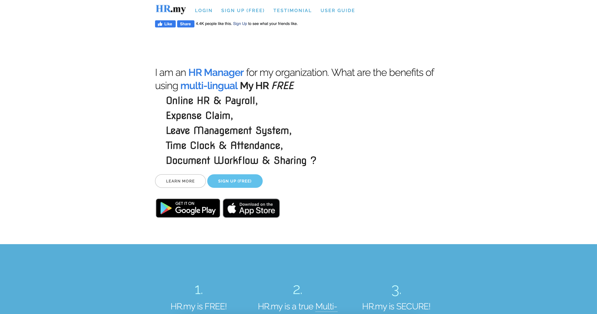

# Assignment 01 — DH110 Spring 2021

## by Justin Grant UX Researcher UCLA
### Human Resources Heuristics

I am the web developer and designer for a company that produces HR material for employers and HR Professionals.  This project's goal is to help me understand how HR websites differ from hrsimple.com. My intent is to learn what is missing from hrsimple.com by performing heuristics on competitor websites. 

### HR.my Heuristics

You can Visit HR.my by clicking this link: <a href="https://hr.my" target="_blank" aria-label="External link to HR.my website">Visit HR.my website</a>

HR.my is a website for employers to track employee information.  HR.my allows employers to set specific tasks for employees like clocking into work, or requesting vacation time.  Most of all, the website is tailored for both employer and employee.  The employer sets up the account and tracks their employee and the employee gets access to the site to view their information and request specific actions. 

Overall, the website is minimal in design but needs significant improvement.  The website is free to use, but the web developer does ask for donations, too. I signed up for free and was notified with an informative error message that I already had an account.  Requesting to change my password was simple and followed the usually standards.  However, the site has a lot of advertisements on it, which seem to trick the user to click them when attempting to navigate through the website.  For example, when I clicked on a link to learn how to enter employee information, an advertisement popped up.   There was no way to exit except for clicking on the background page of the popup modal.  

Also, I encountered an error when attempting enter a job title for an employee.  The only reason I know an error occured is due to my experience using websites. That is, a spinning wheel, which indicates the website is doing something, popped up but it continues spinning.  **See screen shot below:** 

