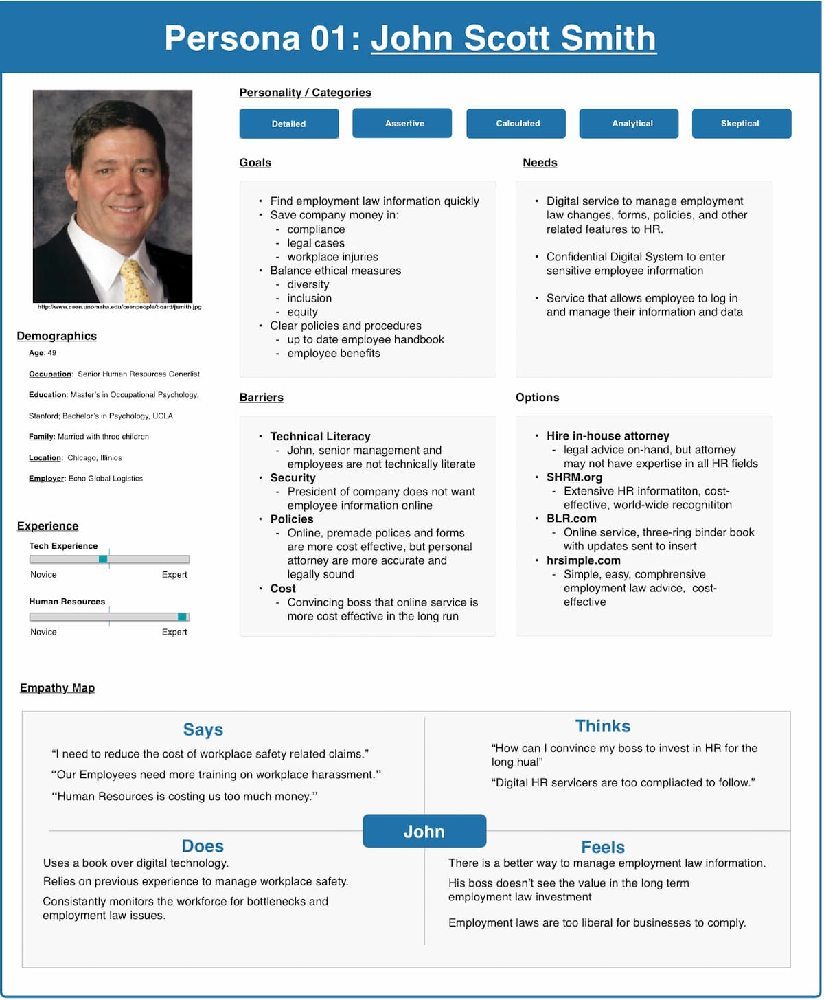
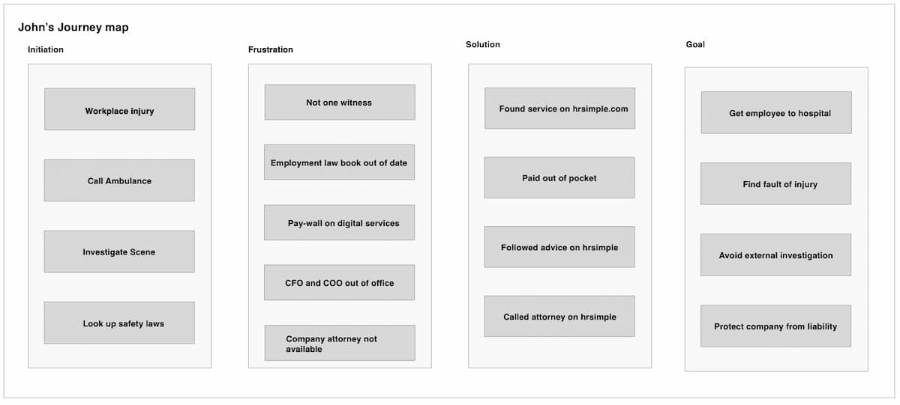
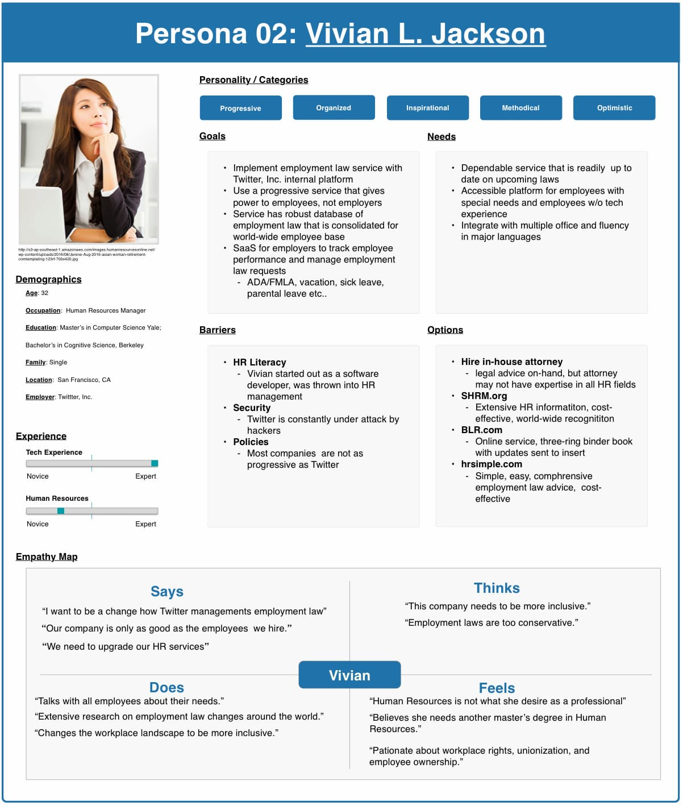
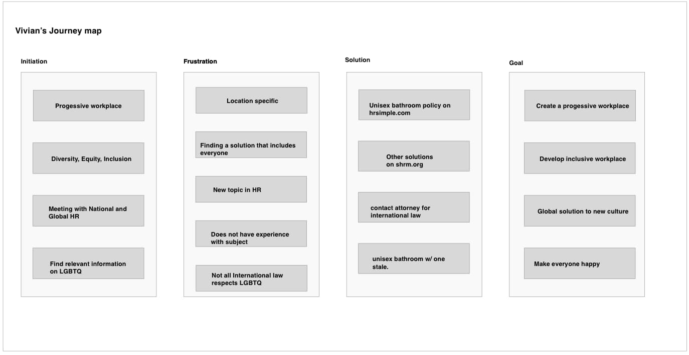

# DH110 Assignment 04: Persona+Scenario
## Human Resources Professionals: John and Vivian
### *Created by Justin Grant*

## UX Storytelling
The importance of UX storytelling is similar to the philosophy of mind. The questions "what is a mind, mental states and feelings" are very similar to understanding a persona from a UX / Product Design standpoint. UX storytelling attempts to understand a person who uses a digital product (anything!). What do they experience? How do they feel? Which actions do they take when x or y happen? All of these questions are philosophical in the sense of mind and brain states. One way to map these questions is through persona development — a hero's journey in film and movies. For example, what does John Scott Smith do when x or y happens at work? What does Vivian do to implement a progressive policy at Twitter? Aside from understanding the intentionality of these two fictional people, a UX story helps a designer or researcher map out the probability of actions, goals, tasks, situations, and other human factors at play.

## Improving HR services
I have experience with HR services, so I figured it would be best to try and put myself in a Human Resources Professional's shoes.  I intend to improve the usability of mostly informational HR websites.  I have identified three features such a website can improve on: 

1. Finding answers quickly
2. The ability to talk with a professional in a short timeframe
3. Limit the actions required to accomplish goals.

## Persona + Empathy Maps
### Persona 01 John Scott Smith

### John Scott Smith Journey Map

### John Scott Smith Scenario
**Setting: Workplace injury**
**Event:** This morning, one of John's employees slipped on wet flooring, hit his head, and broke his hand.  No other employee was around to witness the accident, but the employee who slipped and fell claimed that it is the company's fault for the wet flooring.  After calling an ambulance, John investigated the accident site and found water on the ground, but he couldn't find the water source.  The roof didn't leak it and there were no water lines or leaky pipes.  

**Situation:** Attempting to find relevant information in a short timeframe
**Task:** John called his attorney, but his attorney was not available until the next day. John's boss insisted that he begin investigating the accident immediately.  John searched his employment law books for workplace accidents, but the book was filled with legal jargon that he could not understand, so he searched the internet for advice. To his disappointment, the majority of the website he found with relevant information had a pay-wall.  

**Goal:** To find information to protect the company from this morning's accident.
Action: He wasn't authorized to purchase anything on the company card unless the CFO and the COO authorized it.  Unfortunately, both executives were out of the office for the day.  So, John signed up for a free trial to hrsimple.com.  After searching through hrsimple.com, John found a sample form to fill out and help detail the accident.  He also found some basic information about workplace injuries and how to deal with those injuries.  However,  he couldn't find any information about investigating other employees and the employee who slipped and fell on the wet floor. 

**Solution:** Free one-hour consultation with an attorney
Thankfully, hrsimple.com offers a free one-hour consultation with an attorney.   He was able to understand his rights under the law and conducted a workplace investigation. 

**Problem:**  Getting reimbursed from CFO. 

## Persona 02 Vivian L. Jackson

### Vivian L. Jackson Journey Map

### Vivian L. Jackson Scenario
**Setting:** LGBTQ — Locally, Nationally, Globally
**Event:** Twitter's headquarters has policies and procedures for LGBTQ employees, but other locations throughout America and worldwide are slow to implement Twitter's policies.  As of last week, Twitter has had 25 complaints about transgender bathrooms.  Some of the complaints are from the transgender community, while others of from female employees were complaining about transgender males using the women's restrooms.  

**Situation:** How to implement a bathroom policy for all employees
**Task:** Vivian is the HR Manager for Twitter's headquarters and oversees national and worldwide HR departments.  Thankfully, the headquarters in California is up to date and progressive with the employment law practices surrounding the LGBTQ community.  However, other states are not up to speed.   Vivian needs to understand how to implement policies and procedures that are in line with Twitter's headquarter location.  The only problem is that a lot of buildings have two bathrooms: one male and one female.  She needs to find information regarding transgender bathrooms.

**Goal:** Implement a company policy for transgender people without creating complications between other genders.
Action: Vivian requested a virtual meeting with her global HR team to understand how to implement transgender bathrooms in states and countries without transgender laws.  She began researching transgender bathrooms online and stumbled across a blog post by hrsimple.com.  In the post, hrsimple.com gave specific guidelines to make everyone happy.  The website recommends a unisex bathroom and things not to do, such as asking employees to provide medical documentation.  hrsimple also discusses how to curate a policy and provides an example policy for the United States.
Problem: Vivian needs to find international laws on transgender bathrooms.  Unfortunately, hrsimple.com does not provide international law.  

**Solution:** Find as much online information as possible before contacting an international attorney.  Vivian took hrsimple.com's advice on transgender bathrooms.  In addition to hrsimple.com, she looked up other policies and procedures on shrm.org.  Altogether,  her team gathered enough information from the united states before contacting an international attorney.  

